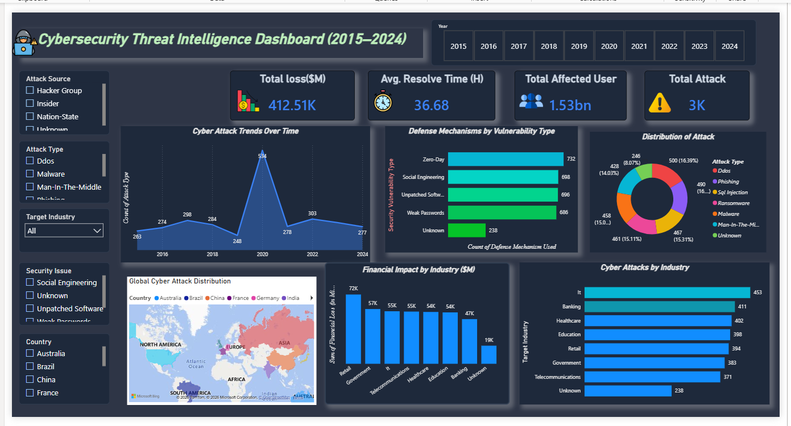

# 🛡️ Cybersecurity Threat Intelligence Dashboard (2015–2024)

## 📌 Project Overview

The Cybersecurity Threat Intelligence Dashboard is an interactive Power BI project designed to analyze global cybersecurity incidents from 2015 to 2024. The dashboard provides comprehensive insights into cyber attack trends, financial losses, affected users, vulnerabilities, attack sources, defense mechanisms, and industry-wise risk exposure.

The objective of this project is to transform cybersecurity incident data into actionable insights that help organizations understand threat patterns, assess business risks, and improve cybersecurity decision-making.

## 🎯 Business Problem

Cyber attacks continue to grow in frequency and complexity, causing substantial financial losses and operational disruptions across industries.

Organizations require a centralized reporting solution to:

Monitor cyber attack trends over time
Identify industries most vulnerable to attacks
Measure financial impact
Analyze attack types and vulnerabilities
Evaluate cybersecurity defense strategies
Support proactive security planning

This dashboard addresses these challenges through interactive visualizations and KPI-driven reporting.

## 📊 Dashboard Preview
Main Dashboard

Add your dashboard screenshot below after uploading it to GitHub.



## 📈 Executive KPIs
### KPI	Value
Total Cyber Attacks	3,000
Total Affected Users	1.53 Billion
Total Financial Loss	$412.51K Million
Average Resolution Time	36.68 Hours

## 🚀 Dashboard Features
### 📅 Yearly Attack Trend Analysis

Tracks cyber attack trends between 2015 and 2024.

### 🏭 Industry-Wise Analysis

Identifies industries most affected by cybersecurity incidents.

### 💰 Financial Impact Analysis

Measures monetary losses caused by cyber attacks.

### 🌎 Geographic Analysis

Visualizes attack distribution across countries and regions.

### 🔐 Vulnerability Analysis

Analyzes the most exploited cybersecurity weaknesses.

### 🛡️ Defense Mechanism Evaluation

Examines security controls used against different vulnerabilities.

### 🎛 Interactive Filtering

Users can dynamically filter data by:

Year
Country
Attack Type
Attack Source
Target Industry
Security Vulnerability

## 🔍 Key Business Insights
### 1. Cyber Attacks Peaked in 2020

The highest number of cyber attacks occurred in 2020, with 534 reported incidents.

#### Insight

The rapid increase highlights the growing sophistication and frequency of cyber threats globally.

#### Recommendation

Organizations should strengthen cybersecurity monitoring and incident response capabilities.

### 2. IT Industry Is the Most Targeted Sector
| Industry | Total Attacks |
|----------|--------------:|
| IT | 453 |
| Banking | 411 |
| Healthcare | 402 |
| Education | 398 |
| Retail | 394 |

#### Insight

Industries handling sensitive customer and financial data remain prime targets for attackers.

#### Recommendation

High-risk industries should prioritize continuous security monitoring and advanced threat detection.

### 3. Retail Industry Recorded the Highest Financial Loss
| Industry | Financial Loss ($M) |
|----------|--------------------:|
| Retail | 72 |
| Government | 57 |
| IT | 55 |
| Telecommunications | 55 |
| Healthcare | 54 |
#### Insight

Cybersecurity incidents significantly impact organizational profitability and operational continuity.

#### Recommendation

Invest in cybersecurity risk management and business continuity planning.

### 4. Zero-Day Vulnerabilities Represent the Largest Risk
| Vulnerability Type | Incidents |
|--------------------|----------:|
| Zero-Day | 732 |
| Social Engineering | 698 |
| Unpatched Software | 696 |
| Weak Passwords | 686 |
#### Insight

Zero-Day vulnerabilities continue to be heavily exploited by cybercriminals.

#### Recommendation

Implement regular vulnerability assessments and proactive patch management.

### 5. Social Engineering Remains a Major Threat
#### Insight

Human error continues to contribute significantly to cybersecurity incidents.

#### Recommendation

Conduct employee awareness programs and phishing simulation exercises.

### 6. Multi-Layer Security Is Essential

Most commonly deployed security controls include:

Firewall
VPN
Antivirus
Encryption
AI-Based Detection
#### Insight

Organizations increasingly rely on layered security architectures to mitigate cyber risks.

### Recommendation

Combine preventive, detective, and corrective security measures.

## 💡 Business Recommendations
### Strengthen Vulnerability Management
Regular vulnerability scanning
Timely software patching
Risk prioritization

### Enhance Employee Security Awareness
Cybersecurity training programs
Phishing simulations
Security best practices

### Implement Multi-Factor Authentication (MFA)
Strengthen access control
Reduce credential-based attacks

### Adopt AI-Powered Threat Detection
Real-time monitoring
Early threat identification
Automated incident response

### Improve Incident Response Planning
Security playbooks
Faster resolution times
Business continuity readiness


## ⚙️ Technical Implementation
### Data Preparation

Performed data cleaning and transformation using Power Query:

Removed inconsistencies
Standardized data formats
Processed missing values
Improved data quality
### Data Modeling

Designed an optimized data model for:

Efficient reporting
Fast query performance
Cross-filter analysis

### DAX Measures Created
#### KPI Measures
Total Financial Loss
Total Attacks
Total Affected Users
Average Resolution Time

#### Analytical Measures
Industry Attack Count
Financial Impact Metrics
Vulnerability Analysis
Trend Analysis

## 🛠️ Tools & Technologies
| Tool | Purpose |
|------|---------|
| **Power BI** | Dashboard Development |
| **Power Query** | Data Transformation and Data Cleaning |
| **DAX (Data Analysis Expressions)** | KPI and Measure Creation |
| **Microsoft Excel** | Data Source |
| **Data Modeling** | Relationship Management and Data Modeling |
## 📂 Dataset Information

The dataset includes cybersecurity incidents recorded globally between 2015 and 2024.

### Key Attributes
Country
Year
Attack Type
Attack Source
Target Industry
Financial Loss
Affected Users
Security Vulnerability
Defense Mechanism
Resolution Time
## 🎯 Skills Demonstrated
### Technical Skills
Power BI Development
Data Visualization
DAX
Power Query
Data Modeling
Dashboard Design
KPI Development

### Analytical Skills
Business Intelligence
Trend Analysis
Risk Assessment
Data Storytelling
Insight Generation

## 📁 Repository Structure
```text
Cybersecurity-Threat-Intelligence-Dashboard/
│
├── Dashboard.pbix                     # Power BI dashboard file
├── Dataset.xlsx                       # Source dataset
├── Dashboard_Screenshot.png           # Dashboard preview
├── Cybersecurity_Insights_Report.pdf  # Project report
├── README.md                          # Project documentation
```
## 📌 Project Outcomes

✅ Identified high-risk industries targeted by cybercriminals.

✅ Evaluated financial impact across business sectors.

✅ Analyzed attack trends and threat evolution over time.

✅ Assessed vulnerabilities and defense strategies.

✅ Delivered actionable cybersecurity insights through interactive reporting.

### 👨‍💻 Author
##### Vikku Kumar

##### Aspiring Data Analyst | Power BI | SQL | Python | Excel

##### Connect With Me
##### LinkedIn: [(Connect With LinkedIn)](https://www.linkedin.com/in/vikku-kumar/)
##### GitHub: [(Connect With GitHub)](https://github.com/Vikku018)

#### ⭐ Support

If you found this project useful, please consider giving it a Star ⭐ on GitHub.

Feedback and suggestions are always welcome! 🚀
